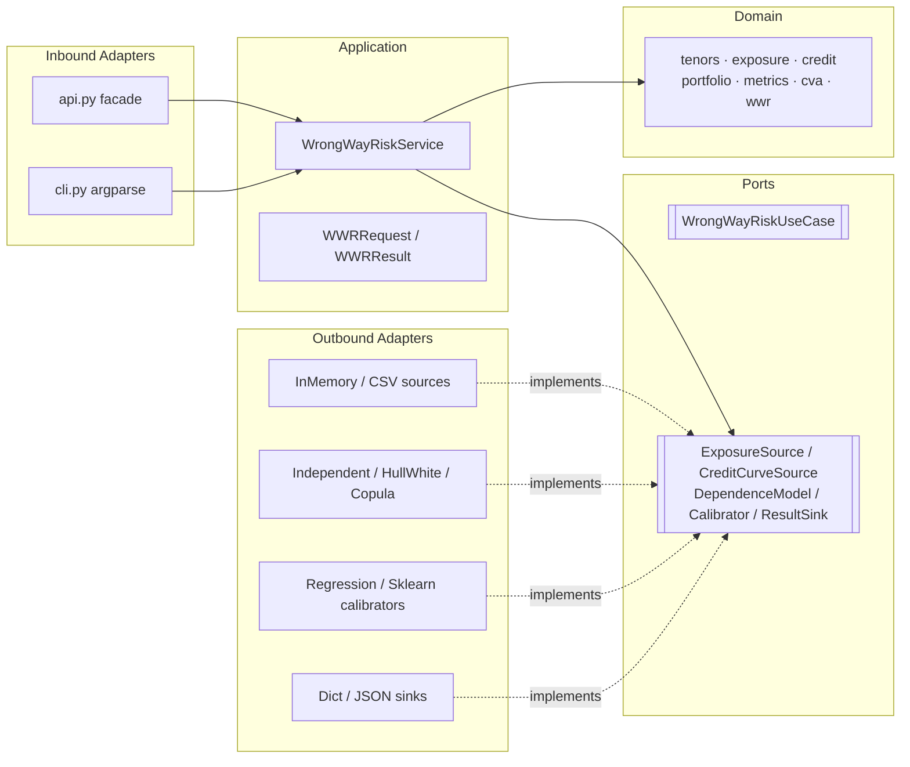

# Architecture

`wayfault` follows a strict **hexagonal (ports & adapters)** design. The
dependency rule points **inward**:

```
adapters  →  application  →  ports  →  domain
```

The `domain`, `application`, and `ports` layers import **only the standard
library and numpy**. Adapters depend on ports (Protocols), never on each other.



## Layers

### Domain (pure)

Value objects and pure functions, importing only stdlib + numpy:

- [`TenorGrid`][wayfault.domain.tenors.TenorGrid] — strictly increasing
  year-fractions.
- [`ExposureCube`][wayfault.domain.exposure.ExposureCube] /
  [`EEProfile`][wayfault.domain.exposure.EEProfile] — exposure values.
- [`CreditCurve`][wayfault.domain.credit.CreditCurve] /
  [`RecoveryRate`][wayfault.domain.credit.RecoveryRate] — credit term structure.
- [`Counterparty`][wayfault.domain.portfolio.Counterparty] /
  [`NettingSet`][wayfault.domain.portfolio.NettingSet] — aggregation.
- `metrics` (EPE/ENE/PFE/EEPE), `cva` (the CVA integral), `wwr` (alpha,
  classification, diagnostics).

### Ports

Pure `typing.Protocol` definitions — the seams between the application and the
outside world. See [Ports API](api/ports.md).

### Application

[`WrongWayRiskService`][wayfault.application.service.WrongWayRiskService]
orchestrates: load exposure → load credit → calibrate model → baseline metrics
→ conditional EE → WWR-CVA, alpha, diagnostics → `WWRResult`. No I/O leaks; all
external concerns flow through ports.

### Adapters

Concrete implementations of the ports. Heavy dependencies (`pandas`,
`scikit-learn`) are imported **lazily** inside the method that needs them, so
the core stays import-pure.

## The dependency rule in practice

!!! success "What this buys you"
    - Swap the dependence model, the data source, or the output format without
      touching the domain or the service.
    - Unit-test the domain with zero mocks.
    - Keep the install lean: `numpy` only, unless you opt into an extra.

## Package layout

```
src/wayfault/
├── __init__.py            # public facade + result types
├── domain/                # PURE: stdlib + numpy
├── application/           # service + DTOs
├── ports/                 # inbound + outbound Protocols
└── adapters/
    ├── inbound/           # api.py facade, cli.py
    └── outbound/          # sources, models, calibrators, sinks
```
