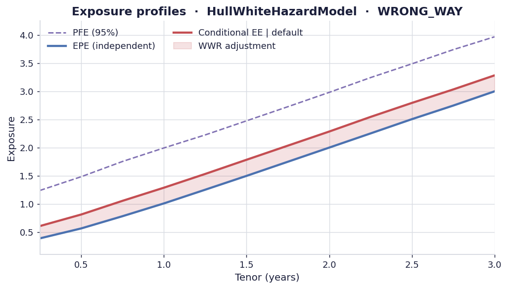
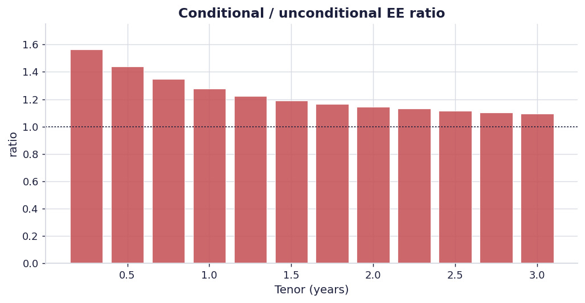
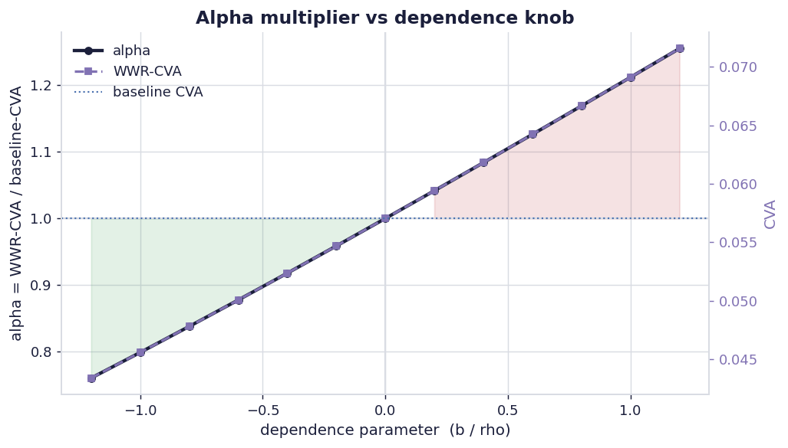
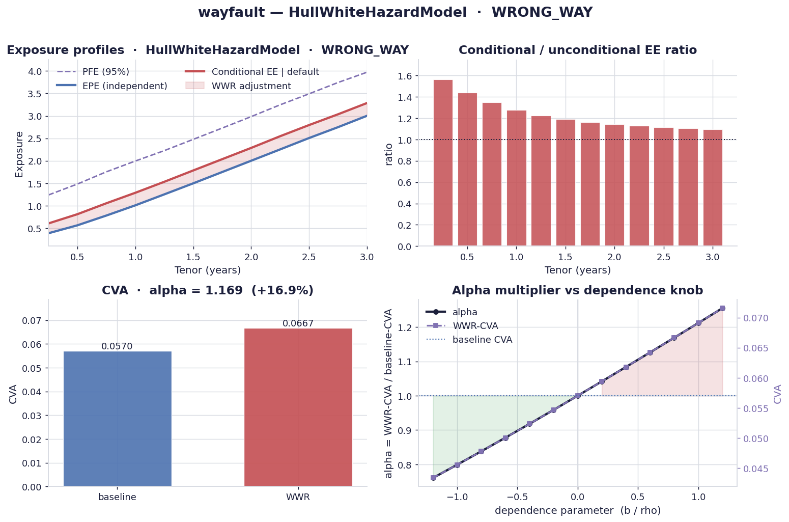

# Visualization

The `[viz]` extra adds a small, beautiful matplotlib plotting module. Like every
optional adapter it imports matplotlib **lazily** — importing `wayfault` stays
numpy-only.

```bash
pip install 'wayfault[viz]'
```

All functions live in
[`wayfault.adapters.outbound.viz`][wayfault.adapters.outbound.viz], return a
`matplotlib.figure.Figure`, and never call `show()` — you decide whether to
display or save.

## Exposure profiles

EPE, conditional EE given default, and PFE across the tenor grid. The shaded gap
is the wrong-/right-way adjustment.

```python
from wayfault import estimate_wwr
from wayfault.adapters.outbound import viz
from wayfault.adapters.outbound.exposure_inmemory import InMemoryExposureSource
from wayfault.adapters.outbound.credit_flat import FlatHazardCreditCurveSource
from wayfault.adapters.outbound.dependence_hullwhite import HullWhiteHazardModel
import numpy as np

tenors = [i / 4 for i in range(1, 13)]
cube = np.asarray(tenors) + np.random.default_rng(0).normal(scale=0.6, size=(20_000, 12))
exposure = InMemoryExposureSource(cube, tenors)
credit = FlatHazardCreditCurveSource(hazard=0.02, recovery=0.4)

result = estimate_wwr(exposure, credit, HullWhiteHazardModel(b=0.8))

fig = viz.plot_exposure_profiles(result)
viz.save(fig, "exposure_profiles.png")
```



## EE ratio

Per-tenor conditional/unconditional EE ratio — red bars above 1 (wrong-way),
green below 1 (right-way).

```python
fig = viz.plot_ee_ratio(result)
```



## Alpha sweep

Sweep the dependence knob and plot the alpha multiplier (and CVA) against it.
The shading flips colour at the independence point.

```python
bs = np.linspace(-1.2, 1.2, 13)
sweep = [estimate_wwr(exposure, credit, HullWhiteHazardModel(b=b)) for b in bs]
alphas = [r.alpha for r in sweep]
wwr_cvas = [r.wwr_cva for r in sweep]

fig = viz.plot_alpha_sweep(bs, alphas, wwr_cvas, baseline_cva=sweep[0].baseline_cva)
```



## Dashboard

Everything at a glance: profiles, EE ratio, CVA comparison, and the alpha curve.

```python
fig = viz.plot_dashboard(result, bs=bs, alphas=alphas, wwr_cvas=wwr_cvas)
viz.save(fig, "dashboard.png")
```



!!! tip "Reproducing the gallery"
    All four images are generated by
    [`examples/gallery.py`](https://github.com/daibeal/wayfault/blob/main/examples/gallery.py):

    ```bash
    pip install 'wayfault[viz]'
    python examples/gallery.py
    ```

## API

::: wayfault.adapters.outbound.viz
